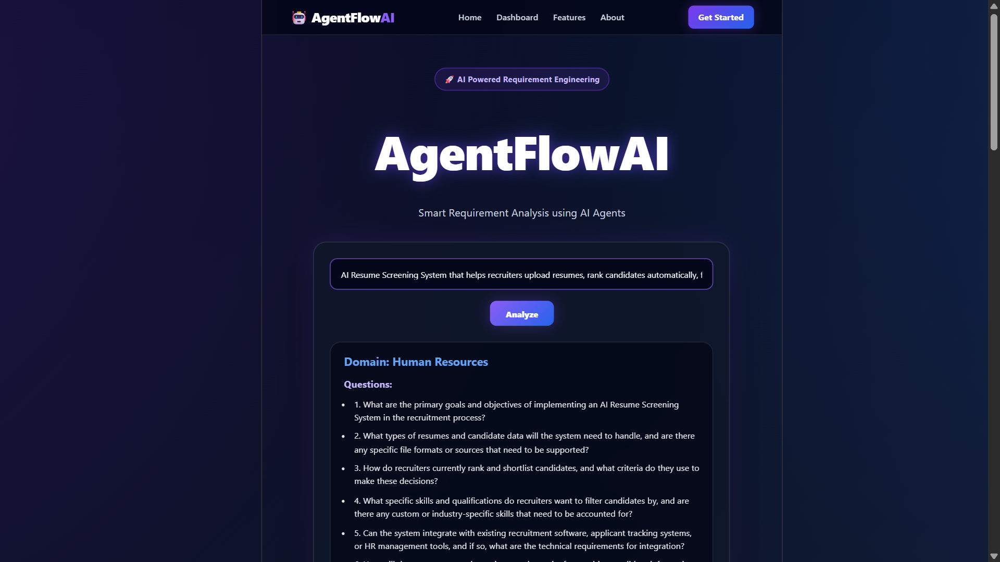
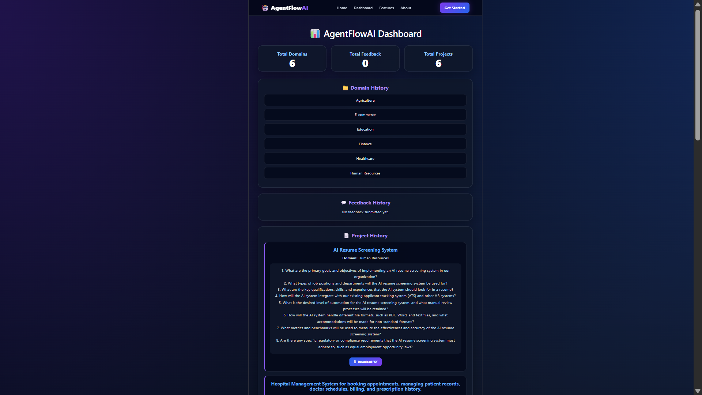
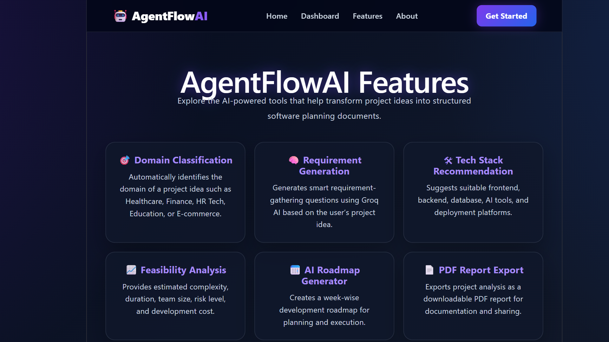
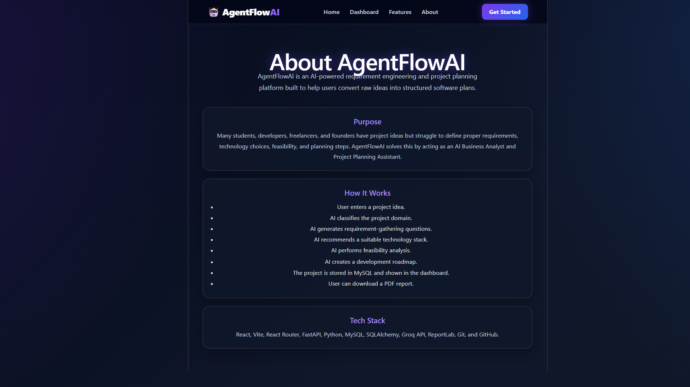
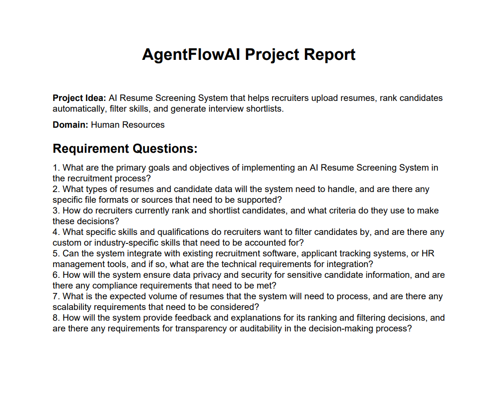

# AgentFlowAI

AgentFlowAI is an AI-powered requirement engineering and project planning platform that helps users convert raw project ideas into structured software planning outputs.

It uses AI agents to classify project domains, generate requirement-gathering questions, recommend suitable technology stacks, analyze feasibility, generate project roadmaps, store project history, and export project reports as PDF files.

---

## 🚀 Features

* AI-powered domain classification
* AI-generated requirement gathering questions
* AI-based technology stack recommendation
* AI feasibility analysis
* AI project roadmap generation
* Project history storage
* Feedback collection
* Analytics dashboard
* PDF project report export
* React Router based navigation
* MySQL database integration
* Modern dark themed SaaS-style UI

---

## 🧠 How AgentFlowAI Works

1. User enters a project idea.
2. The backend classifies the project domain using AI.
3. The requirement agent generates requirement-gathering questions.
4. The tech stack agent recommends suitable technologies.
5. The feasibility agent analyzes complexity, duration, risk, team size, and cost.
6. The roadmap agent generates a development roadmap.
7. The project is stored in MySQL.
8. Dashboard displays project history, domain history, feedback, and analytics.
9. User can download a PDF report for each project.

---

## 🏗️ System Architecture

```text
User
 ↓
React Frontend
 ↓
FastAPI Backend
 ↓
AI Agents using Groq API
 ↓
MySQL Database
 ↓
Dashboard + PDF Report Export
```

---

## 🛠️ Tech Stack

### Frontend

* React
* Vite
* React Router DOM
* Axios
* CSS

### Backend

* FastAPI
* Python
* SQLAlchemy
* PyMySQL
* ReportLab

### AI Integration

* Groq API
* Llama models

### Database

* MySQL

### Version Control

* Git
* GitHub

---

## 📌 AI Agents Used

### 1. Domain Classification Agent

Classifies the project idea into a suitable domain such as Healthcare, Finance, Education, HR Tech, E-commerce, or Technology.

### 2. Requirement Generation Agent

Generates requirement-gathering questions based on the project idea.

### 3. Tech Stack Recommendation Agent

Suggests frontend, backend, database, AI tools, and deployment platforms.

### 4. Feasibility Analysis Agent

Analyzes project complexity, duration, team size, risks, and cost.

### 5. Roadmap Agent

Generates a week-wise development roadmap.

---

## 📊 Dashboard Features

The dashboard shows:

* Total domains
* Total feedback entries
* Total projects
* Domain history
* Feedback history
* Project history
* Download PDF report option

---

## 📄 PDF Report Export

Each project can be exported as a PDF report containing:

* Project idea
* Domain
* Requirement questions
* Project report title

Future versions can include:

* Tech stack recommendation
* Feasibility analysis
* Roadmap
* BRD/SRS document

---

## 📁 Project Structure

```text
AgentFlowAI/
│
├── backend/
│   ├── agents/
│   │   ├── domain_classifier.py
│   │   ├── requirement_agent.py
│   │   ├── tech_stack_agent.py
│   │   ├── feasibility_agent.py
│   │   └── roadmap_agent.py
│   │
│   ├── models/
│   │   ├── domain_model.py
│   │   ├── feedback_model.py
│   │   └── project_model.py
│   │
│   ├── utils/
│   │   └── pdf_generator.py
│   │
│   ├── database.py
│   ├── db_dependency.py
│   ├── main.py
│   └── requirements.txt
│
├── frontend/
│   ├── src/
│   │   ├── components/
│   │   │   ├── Navbar.jsx
│   │   │   ├── ProjectForm.jsx
│   │   │   └── Dashboard.jsx
│   │   │
│   │   ├── pages/
│   │   │   ├── Home.jsx
│   │   │   └── DashboardPage.jsx
│   │   │
│   │   ├── App.jsx
│   │   └── App.css
│   │
│   └── package.json
│
├── README.md
└── .gitignore
```

---

## ⚙️ Backend Setup

Go to the backend folder:

```bash
cd backend
```

Create and activate virtual environment:

```bash
python -m venv venv
venv\Scripts\activate
```

Install dependencies:

```bash
pip install -r requirements.txt
```

Create a `.env` file inside the backend folder:

```env
MYSQL_USER=root
MYSQL_PASSWORD=your_mysql_password
MYSQL_HOST=localhost
MYSQL_DB=agentflowai_db
GROQ_API_KEY=your_groq_api_key
```

Run the FastAPI server:

```bash
python -m uvicorn main:app --reload
```

Backend will run at:

```text
http://127.0.0.1:8000
```

Swagger API docs:

```text
http://127.0.0.1:8000/docs
```

---

## 💻 Frontend Setup

Go to the frontend folder:

```bash
cd frontend
```

Install dependencies:

```bash
npm install
```

Run frontend:

```bash
npm run dev
```

Frontend will run at:

```text
http://localhost:5173
```

---

## 🗄️ Database Setup

Create a MySQL database:

```sql
CREATE DATABASE agentflowai_db;
```

The tables are created automatically by SQLAlchemy when the FastAPI backend starts.

Main tables:

* domains
* feedback
* projects

---

## 🔗 Important API Endpoints

| Method | Endpoint                        | Description                                                    |
| ------ | ------------------------------- | -------------------------------------------------------------- |
| GET    | `/`                             | Backend health check                                           |
| POST   | `/requirements`                 | Generate AI requirements, tech stack, feasibility, and roadmap |
| POST   | `/classify-domain`              | Classify project domain                                        |
| POST   | `/feedback`                     | Save user feedback                                             |
| GET    | `/dashboard/stats`              | Get dashboard statistics                                       |
| GET    | `/dashboard/domains`            | Get domain history                                             |
| GET    | `/dashboard/feedback`           | Get feedback history                                           |
| GET    | `/dashboard/projects`           | Get project history                                            |
| POST   | `/roadmap`                      | Generate AI project roadmap                                    |
| GET    | `/download-report/{project_id}` | Download PDF project report                                    |

---

## 📸 Screenshots

Add your screenshots here:

## 📸 Screenshots

### Home Page


### Dashboard


### Features Page


### About Page


### PDF Report



## 🎯 Future Enhancements

* User authentication
* BRD/SRS generation
* Full project architecture diagram generation
* Search and filter projects
* Cloud deployment
* Admin dashboard
* Advanced analytics charts
* Team collaboration support

---

## 📌 Resume Description

AgentFlowAI is an AI-powered requirement engineering platform built using React, FastAPI, MySQL, SQLAlchemy, Groq LLMs, and ReportLab. It classifies project domains, generates requirement questions, recommends tech stacks, performs feasibility analysis, creates development roadmaps, stores project history, displays analytics, and exports PDF project reports.

---

## 👨‍💻 Author

**Shiv Prakash K**

GitHub: [spg0wda](https://github.com/spg0wda)
